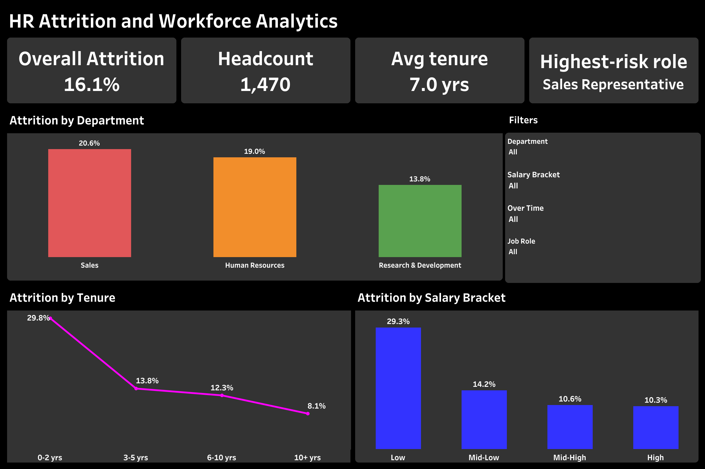

<div align="center">

# 📉 HR Employee Attrition & Workforce Analytics

### End-to-End Data Analytics Project using SQL, Python & Tableau

Analyze employee attrition patterns, uncover retention risk factors, and build an interactive Tableau dashboard for data-driven HR decision-making.


</div>

---

# 📊 Dashboard Preview

<p align="center">
  
</p>

---

# 📌 Project Overview

This project analyzes employee attrition using **SQL, Python, and Tableau** to identify which departments, job roles, tenure bands, and salary brackets carry the highest turnover risk, and what factors — overtime, income, satisfaction — drive it.

The project follows a complete analytics workflow from data cleaning to dashboard development, transforming raw HR data into actionable retention insights.

---

# 🎯 Business Objectives

- Identify departments and job roles with the highest attrition.
- Understand how tenure and salary relate to attrition risk.
- Investigate the impact of overtime and job satisfaction on turnover.
- Measure workforce health using KPIs.
- Create an interactive dashboard for HR decision-making.

---

# 📂 Dataset Information

| Attribute | Details |
|-----------|---------|
| Source | Kaggle |
| Dataset | IBM HR Analytics Employee Attrition & Performance |
| Records | ~1,470 |
| Format | CSV |
| Domain | Human Resources / Workforce Analytics |

---

# ⭐ Key Features

- Cleaned and prepared employee data using Python and Pandas.
- Engineered Tenure Band and Salary Bracket features for grouped analysis.
- Performed Exploratory Data Analysis (EDA) to understand attrition drivers.
- Wrote SQL queries to answer key retention questions.
- Designed an interactive Tableau dashboard with dynamic filters.
- Presented business insights through KPIs and visualizations.

---

# 🛠️ Technology Stack

| Technology | Purpose |
|------------|---------|
| Python | Data Cleaning & Analysis |
| Pandas / NumPy | Data Manipulation |
| Matplotlib | Exploratory Visualization |
| SQL (MySQL) | Business Analysis |
| Tableau | Interactive Dashboard |

---

# 🔄 Project Workflow

```text
Kaggle Dataset
      │
      ▼
Python Data Cleaning
      │
      ▼
Exploratory Data Analysis
      │
      ▼
SQL Business Analysis
      │
      ▼
Interactive Tableau Dashboard
      │
      ▼
Retention Insights
```

---

# 🧹 Data Cleaning

The dataset was cleaned using Python before analysis.

Cleaning steps included:

- Handling missing values
- Standardizing department and job role labels
- Encoding categorical fields (Attrition, OverTime)
- Engineering Tenure Band and Salary Bracket features
- Preparing the dataset for SQL and Tableau

---

# 📈 Exploratory Data Analysis (EDA)

EDA was performed using **Python** to understand attrition drivers.

The analysis focused on:

- Attrition vs. overtime status
- Attrition vs. monthly income
- Attrition vs. years at company
- Attrition vs. job satisfaction
- Correlation between numeric workforce factors

### Python Libraries Used

- Pandas
- Matplotlib

---

# 🗄️ SQL Business Analysis

SQL queries were written to answer key retention questions:

- Attrition Rate by Department
- Attrition Rate by Job Role
- Attrition Rate by Tenure Band
- Attrition Rate by Salary Bracket

---

# 📊 Dashboard Features

### KPI Cards

- 👥 Headcount
- 📉 Overall Attrition Rate
- ⏳ Average Tenure
- ⚠️ Highest-Risk Role

### Interactive Filters

- Department
- Job Role
- Salary Bracket
- Over Time

### Visualizations

- Attrition by Department
- Attrition by Tenure
- Attrition by Salary Bracket

---

# 💡 Key Business Insights

- Overall attrition rate is **16.1%** across 1,470 employees, with an average tenure of **7.0 years**.
- **Sales** has the highest departmental attrition at **20.6%**, followed by HR (19.0%) and R&D (13.8%) — **Sales Representative** is the highest-risk role.
- Attrition is heavily front-loaded: employees in their **first 0–2 years** leave at **29.8%**, dropping to just **8.1%** for employees with 10+ years.
- Lower-income employees leave far more often: the **Low salary bracket** attrites at **29.3%**, nearly **3x** the rate of the High bracket (10.3%).

---

# 📁 Repository Structure

```text
HR-Employee-Attrition-Analytics
│
├── README.md
├── hr_cleaned.csv
├── HR_Employee_Attrition_Analysis.ipynb
├── hr_cleaned.sql
├── HR_Project.twbx
└── HR_Attrition_Overview.png
```

---

# 🚀 Getting Started

1. Download the dataset.
2. Run the Jupyter Notebook for data cleaning and EDA.
3. Import the cleaned data into MySQL.
4. Execute the SQL queries.
5. Open the Tableau workbook.
6. Explore the interactive dashboard.

---

# 🎯 Skills Demonstrated

- SQL Query Writing
- Data Cleaning
- Exploratory Data Analysis
- Workforce Analytics
- Data Visualization
- Tableau Dashboard Development
- Business Intelligence
- Data Storytelling

---

# 📌 Future Improvements

- Predictive attrition modeling (classification)
- Employee segmentation by risk tier
- Cost-of-attrition estimation
- Power BI dashboard
- Automated data pipeline

---

# 👨‍💻 Author

**Omkar Mishra**

📧 omkarm6379@gmail.com

💻 GitHub: https://github.com/0mkarMishra

---

<div align="center">

### ⭐ If you found this project helpful, please consider giving it a Star!

Thank you for visiting this repository.

</div>
